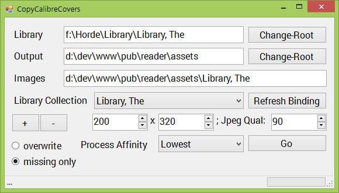

Author:tfw
Author-meta:tfw
Title:README
Subtitle:
Date:
Encoding:utf8
version:tfwio.wordpress.com
mainfont:Roboto Slab
monofont:FreeMono
monoscale:0.8
dh:8in
dw:5in
top:0.75in
bottom:0.75in
lr:0.35in

[Newtonsoft.Json]: http://james.newtonking.com/json
[System.Data.SQLite]: http://system.data.sqlite.org

This project is a MVC4 web application portion of a general collection
of Calibre related navigators.

WHY MVC4 and not WCF or Calibre Plugin?
-----------------------

Provide a friendly/automated sandbox something like NorthWind
to SPA sandbox.

Most all technology has the ability to look at SQLite3 database
and report information on a request-basis.  
While the concept here is to provide JSON data to a local network,
and some additional [features](#features)
Apparently there are a number of tech

MVC4 makes for a good sandbox because you can learn/hack/modify
the application to supply any feature you might like to inject,
as well as use it for HTTP CRUD operations.

PROJECTS
-------------------

### CalibreData.dll

A CSharp .NET core library containing common, core features that are
implemented in the MVC and CopyCalibreCovers apps.

- read from metadata.db using [System.Data.SQLite]
- **read/write `conf.json` configuration** settings using [Newtonsoft.Json]

### Books (MVC)

This is the MVC application.

### CopyCalibreCovers

- Type: Winforms
- Generate and resize cover images for a target library.

FEATURES
---------------------

### Generate JSON Data

### Gnerate and Resize Cover images

TODO
====================

- ConfigController
    - Service JSON configuration
	    - Root Library location
	    - Root Image Location
	    	- support multiple locations?
		- Directories
			- Relative one level under the root library.

LOG
====================

20140825

- changed/Fixed ImageGenerator for the option to only generate missing images.
- implemented methods for detecting sub-directory/libraries within the root library directory (sniffing out `metadata.db`)
- Added a working JSON PUT for automating (the in progress) ConfigController.

SEED - seeded the project with some prototypes.